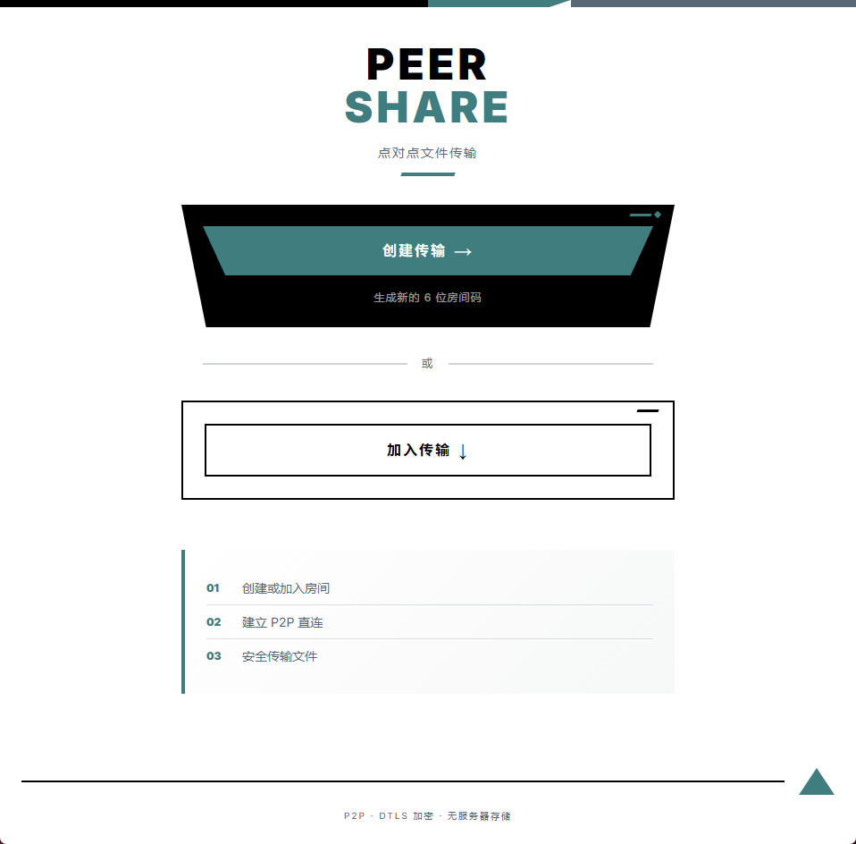
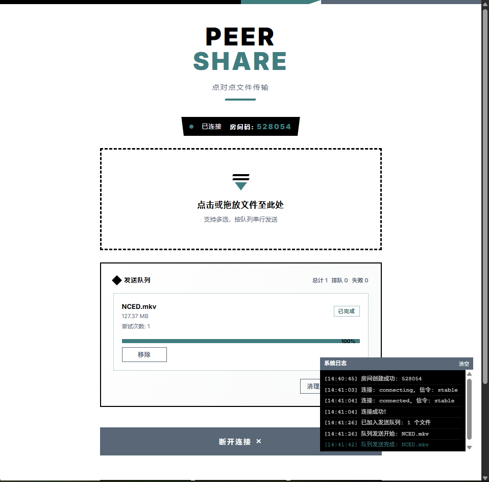

<p align="center">
  <h1 align="center">PeerShare</h1>
  <p align="center">
    基于 WebRTC 的极简点对点文件传输工具
    <br />
    <strong>无需服务器中转 · 无需注册登录 · 部署完成，打开即用</strong>
  </p>
</p>

---

## 📸 截图


*首页 - 创建或加入房间*


*传输中 - 实时进度显示*

---

## ⚙️ 配置指南

### 修改端口号

默认端口为 `3001`。您可以通过以下两种方式修改：

1. **环境变量（推荐）**
   
   在启动时设置 `PORT` 环境变量：
   ```bash
   # Linux/macOS
   PORT=8080 bun run start
   
   # Windows (PowerShell)
   $env:PORT=8080; bun run start
   ```

2. **修改配置文件**

   直接编辑 `src/server/config.ts` 文件：
   ```typescript
   export const SERVER_CONFIG = {
     PORT: 3001, // 修改此处
     // ...
   }
   ```

## 特性

- **纯 P2P 传输** — 文件数据直接在浏览器之间传输，服务器仅负责信令协商，不经手任何文件内容
- **零配置** — 一方创建房间获得 6 位数字房间码，另一方输入即可连接
- **断点续传** — 传输中断后自动恢复，基于 IndexedDB 持久化进度，支持跨会话续传
- **完整性校验** — 块级与文件级双重校验，缺块自动补传，确保传输零损坏
- **背压控制** — 事件驱动 + 轮询自动回退的双模式背压机制，64KB 分块流式传输，避免内存溢出
- **分级重连** — ICE 重启 → 连接重建 → 指数退避，最大程度保障传输连续性
- **多文件队列** — 支持批量选择文件，串行有序传输
- **隐私安全** — 数据不经过任何第三方服务器，传输链路由 WebRTC 加密保护

## 技术栈

| 层级 | 技术 |
|------|------|
| 前端 | React 18 + TypeScript |
| 通信 | 原生 WebRTC DataChannel |
| 信令 | Bun WebSocket |
| 运行时 | [Bun](https://bun.sh) |
| 构建 | Bun Bundler |

## 快速开始

### 环境要求

- [Bun](https://bun.sh)

### 安装与运行

```bash
# 克隆仓库
git clone https://github.com/Ronifue/peershare.git
cd peershare

# 安装依赖
bun install

# 开发模式（热重载）
bun run dev

# 生产构建
bun run build

# 启动生产服务
bun run start
```

开发服务器默认监听 `http://localhost:3001`。

### 使用方式

1. 打开 PeerShare 页面
2. **发送方**：点击「创建房间」，获得 6 位房间码
3. **接收方**：输入房间码，点击「加入房间」
4. 连接建立后，发送方选择文件即可开始传输

## 项目结构

```
peershare/
├── src/
│   ├── client/          # React 前端
│   │   ├── App.tsx      # 应用入口与状态管理
│   │   ├── components/  # UI 组件
│   │   ├── webrtc*.ts   # WebRTC 连接与信令
│   │   ├── transfer-*.ts # 传输协议（发送/接收/续传/校验）
│   │   └── send-queue.ts # 多文件发送队列
│   ├── common/          # 前后端共享模块
│   │   ├── config.ts    # 统一配置（STUN/ICE/传输参数）
│   │   ├── types.ts     # 类型定义
│   │   └── structured-event.ts # 结构化事件协议
│   └── server/          # Bun 信令服务器
│       └── index.ts     # WebSocket 信令处理
├── public/              # 静态资源与构建输出
├── e2e/                 # Playwright 端到端测试
├── tests/               # 单元测试
└── scripts/             # 构建脚本
```

## 开发命令

```bash
bun run dev        # 开发模式，监听文件变化自动重启
bun run build      # 生产构建
bun run start      # 启动生产服务
bun run test       # 运行单元测试
bun run test:e2e   # 运行端到端测试
bun run typecheck  # TypeScript 类型检查
```

## 工作原理

1. **信令阶段**：双方通过 WebSocket 交换 SDP Offer/Answer 和 ICE Candidate，完成 NAT 穿透协商
2. **传输阶段**：建立 WebRTC DataChannel 后，文件以 64KB 分块流式传输，全程 P2P 直连
3. **可靠性保障**：背压控制防止缓冲区溢出，断线后自动分级重连，支持断点续传和完整性校验

## 浏览器兼容性

支持所有现代浏览器：

- Chrome / Edge 80+
- Firefox 80+
- Safari 15+

> 注意：WebRTC P2P 连接依赖 NAT 类型。对称型 NAT 环境下可能无法直连（本项目仅使用 STUN，并未配置 TURN 中继）。

## 许可证

[MIT LICENSE](LICENSE)


## 特别感谢

- 感谢 [小鹿快传](https://github.com/fanchangyong/deershare) 为本项目提供的灵感来源。